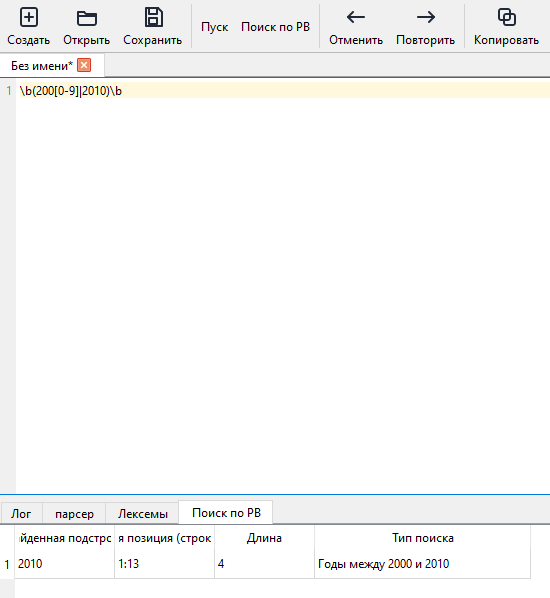
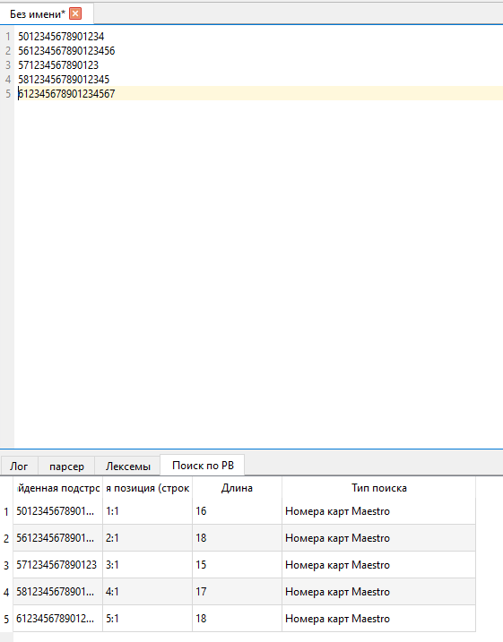
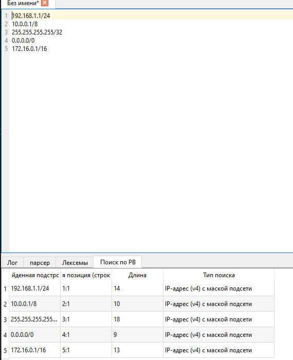

## часть 3 https://github.com/Kokunov777/Parser
## частб 5
# Лабораторная работа 4: Реализация алгоритма поиска подстрок с помощью регулярных выражений

## Цель работы
Изучить теоретические основы регулярных выражений и их применение для поиска и извлечения подстрок из текста. Освоить практические навыки использования библиотечных средств работы с регулярными выражениями, а также интеграцию алгоритмов поиска в графический интерфейс приложения.

## Вариант задания
1. **Годы между 2000 и 2010** – найти все вхождения годов от 2000 до 2010 включительно.
2. **Номера карт Maestro Card** – найти номера карт платежной системы Maestro.
3. **IP-адрес (v4) с маской подсети** – найти IPv4-адреса с указанием маски (например, 192.168.1.1/24).

## Реализация

### Регулярные выражения

#### 1. Годы 2000–2010

**Описание задачи:** Найти все вхождения годов от 2000 до 2010 включительно, которые не являются частью более длинных чисел.

**Регулярное выражение:**
```
\b(200[0-9]|2010)\b
```

**Пояснение обозначений:**
- `\b` – граница слова, гарантирует, что год не является частью большего числа.
- `200[0-9]` – соответствует 2000–2009.
- `2010` – соответствует 2010.
- `|` – логическое ИЛИ.

**Примеры строк, которые должны находиться:**
- `2000`
- `2005`
- `2009`
- `2010`

**Примеры строк, которые не должны находиться:**
- `1999`
- `2011`
- `200`
- `20005`
- `22000`

---

#### 2. Номера карт Maestro

**Описание задачи:** Найти номера карт платежной системы Maestro. Допустимые номера: начинаются с 50, 56–58 или 6, общая длина от 12 до 19 цифр.

**Регулярное выражение:**
```
\b(50[0-9]{10,17}|5[6-8][0-9]{10,17}|6[0-9]{11,18})\b
```

**Пояснение обозначений:**
- `\b` – граница слова.
- `50[0-9]{10,17}` – номера, начинающиеся с 50, за которыми следует от 10 до 17 цифр (всего 12–19 цифр).
- `5[6-8][0-9]{10,17}` – номера, начинающиеся с 56, 57 или 58.
- `6[0-9]{11,18}` – номера, начинающиеся с 6, за которыми следует от 11 до 18 цифр (всего 12–19 цифр).

**Примеры строк, которые должны находиться:**
- `5012345678901234` (16 цифр)
- `561234567890123456` (18 цифр)
- `571234567890123` (15 цифр)
- `58123456789012345` (17 цифр)
- `612345678901234567` (18 цифр)

**Примеры строк, которые не должны находиться:**
- `4912345678901234` (Visa)
- `5112345678901234` (MasterCard)
- `56123456789012345678` (20 цифр)
- `50123456789` (11 цифр)
- `6` (слишком коротко)

---

#### 3. IP-адрес с маской подсети

**Описание задачи:** Найти IPv4-адреса с указанием маски подсети в формате `xxx.xxx.xxx.xxx/yy`, где `xxx` – число от 0 до 255, `yy` – число от 0 до 32.

**Регулярное выражение:**
```
\b((25[0-5]|2[0-4][0-9]|[01]?[0-9][0-9]?)\.){3}(25[0-5]|2[0-4][0-9]|[01]?[0-9][0-9]?)\/([0-9]|[12][0-9]|3[0-2])\b
```

**Пояснение обозначений:**
- `\b` – граница слова.
- `(25[0-5]|2[0-4][0-9]|[01]?[0-9][0-9]?)` – октет от 0 до 255.
- `\.` – точка (экранирована).
- `{3}` – три повторения октета с точкой.
- `\/` – символ '/' (экранирован).
- `([0-9]|[12][0-9]|3[0-2])` – маска от 0 до 32.

**Примеры строк, которые должны находиться:**
- `192.168.1.1/24`
- `10.0.0.1/8`
- `255.255.255.255/32`
- `0.0.0.0/0`
- `172.16.0.1/16`

**Примеры строк, которые не должны находиться:**
- `256.0.0.1/24` (октет >255)
- `192.168.1.1/33` (маска >32)
- `192.168.1.1.1/24` (лишний октет)
- `192.168.1/24` (не хватает октета)
- `192.168.1.1/` (нет маски)

---

### Модуль поиска
Модуль `src/core/regex_search.py` содержит класс `RegexSearcher`, который предоставляет методы для поиска по каждому из трёх шаблонов. Результаты возвращаются в виде списка объектов `MatchResult`, содержащих найденную подстроку, позицию (строка, символ) и длину.

### Интеграция в интерфейс
В графический интерфейс добавлены:
- Кнопка «Поиск по РВ» (горячая клавиша F6) для запуска поиска по всем трём шаблонам одновременно.
- Новая вкладка «Поиск по РВ» в области вывода с таблицей результатов.

Таблица результатов содержит колонки:
- **Найденная подстрока** – извлечённый фрагмент.
- **Начальная позиция (строка:символ)** – номер строки и номер символа в строке.
- **Длина** – количество символов.
- **Тип поиска** – описание шаблона.

### Подсветка найденных подстрок
При двойном щелчке по строке в таблице результатов соответствующая подстрока в редакторе выделяется (selection). Редактор автоматически прокручивается к выделенному фрагменту.

### Обработка ошибок
- При пустом тексте выводится сообщение «Нет данных для поиска».
- При отсутствии совпадений выводится информационное сообщение.
- Ошибки в регулярных выражениях обрабатываются с выводом в QMessageBox.

### Тестовый файл
В корне проекта создан файл `test_samples.txt`, содержащий разнообразные примеры для всех трёх шаблонов, а также отрицательные примеры для проверки отсутствия ложных срабатываний.

## Использование
1. Запустите приложение (`python main.py`).
2. Введите или откройте текст для анализа.
3. Нажмите кнопку «Поиск по РВ» (или F6) на панели инструментов.
4. Результаты поиска по всем трём шаблонам появятся во вкладке «Поиск по РВ».
5. Дважды щёлкните по любой строке таблицы, чтобы перейти к соответствующему фрагменту в тексте.

## Тестовые примеры (скриншоты)

Для демонстрации работы модуля рекомендуется сделать скриншоты интерфейса приложения с результатами поиска по каждому из трёх шаблонов.

### Примеры скриншотов:

1. **Поиск годов 2000–2010** – окно приложения с текстом, содержащим годы, и таблицей результатов с найденными значениями.


2. **Поиск номеров карт Maestro** – аналогично, с номерами карт.



3. **Поиск IP-адресов с маской** – текст с IP-адресами и таблица результатов.



#
